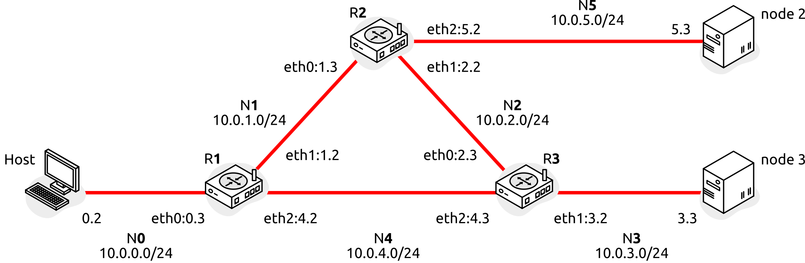

## Topology

- **R1**: RP (Rendezvous Point) at 10.0.4.2
- **node2**: multicast source (N5, gateway 10.0.5.2 via R2)
- **node3**: multicast receiver (N3, gateway 10.0.3.2 via R3)

## PIM-SM

Docs:

- https://docs.frrouting.org/en/stable-10.2/pim.html
- https://docs.frrouting.org/en/stable-10.2/ospfd.html

Setup:

    $ make pim

### OSPF routing

Check unicast routing table (OSPF learns all subnets):

    $ docker exec r1 vtysh -c "show ip route"
    Codes: K - kernel route, C - connected, L - local, S - static,
           R - RIP, O - OSPF, ...

    IPv4 unicast VRF default:
    L>* 10.0.0.3/32 is directly connected, eth0, weight 1, 00:01:35
    L>* 10.0.1.2/32 is directly connected, eth1, weight 1, 00:01:35
    L>* 10.0.4.2/32 is directly connected, eth2, weight 1, 00:01:35
    O   10.0.0.0/24 [110/10] is directly connected, eth0, weight 1, 00:01:35
    C>* 10.0.0.0/24 is directly connected, eth0, weight 1, 00:01:35
    O   10.0.1.0/24 [110/10] is directly connected, eth1, weight 1, 00:00:55
    C>* 10.0.1.0/24 is directly connected, eth1, weight 1, 00:01:35
    O>* 10.0.2.0/24 [110/20] via 10.0.1.3, eth1, weight 1, 00:00:45
    *                        via 10.0.4.3, eth2, weight 1, 00:00:45
    O>* 10.0.3.0/24 [110/20] via 10.0.4.3, eth2, weight 1, 00:00:50
    O   10.0.4.0/24 [110/10] is directly connected, eth2, weight 1, 00:01:35
    C>* 10.0.4.0/24 is directly connected, eth2, weight 1, 00:01:35
    O>* 10.0.5.0/24 [110/20] via 10.0.1.3, eth1, weight 1, 00:00:50

OSPF neighbors:

    $ docker exec r1 vtysh -c "show ip ospf neighbor"
    Neighbor ID     Pri State           Up Time         Dead Time Address         Interface
    10.0.5.2          1 Full/DR         2m59s             35.449s 10.0.1.3        eth1:10.0.1.2
    10.0.4.3          1 Full/DR         2m54s             35.461s 10.0.4.3        eth2:10.0.4.2

### PIM neighbors

    $ docker exec r1 vtysh -c "show ip pim neighbor"
     Interface  Neighbor  Uptime    Holdtime  DR Pri
     eth1       10.0.1.3  00:03:47  00:01:27  1
     eth2       10.0.4.3  00:03:47  00:01:27  1

### Auto-RP

R1 anuncia su candidatura como RP y R3 actúa como Mapping Agent. Todos los routers descubren el RP dinámicamente.

Estado en el Candidate RP (R1):

    $ docker exec r1 vtysh -c "show ip pim autorp"
    AutoRP Discovery is enabled

    Discovered RP's (count=1)
     RP address  Group Range
     10.0.4.2     224.0.0.0/4

    AutoRP Announcement is enabled
      interval 5s scope 31 holdtime 15s

    Candidate RP's (count=1)
     RP address  Group Range  Prefix-List
     10.0.4.2    224.0.0.0/4  -

    AutoRP Mapping-Agent is disabled

Estado en el Mapping Agent (R3):

    $ docker exec r3 vtysh -c "show ip pim autorp"
    AutoRP Discovery is enabled

    Discovered RP's (count=1)
     RP address  Group Range
     10.0.4.2     224.0.0.0/4

    AutoRP Announcement is disabled

    AutoRP Mapping-Agent is enabled
      interval 5s scope 31 holdtime 180s
      source 10.0.4.3 (explicit address)

    Advertised RP's (count=1)
     RP address  Group Range
     10.0.4.2     224.0.0.0/4

### RP info

El campo `Source=AutoRP` confirma que el RP se ha descubierto dinámicamente:

    $ docker exec r1 vtysh -c "show ip pim rp-info"
     RP address  group/prefix-list  OIF   I am RP  Source  Group-Type
     10.0.4.2    224.0.0.0/4        eth2  yes      AutoRP  ASM

    $ docker exec r2 vtysh -c "show ip pim rp-info"
     RP address  group/prefix-list  OIF   I am RP  Source  Group-Type
     10.0.4.2    224.0.0.0/4        eth2  no       AutoRP  ASM

    $ docker exec r3 vtysh -c "show ip pim rp-info"
     RP address  group/prefix-list  OIF   I am RP  Source  Group-Type
     10.0.4.2    224.0.0.0/4        eth2  no       AutoRP  ASM

### PIM interfaces

    $ docker exec r1 vtysh -c "show ip pim interface"
     Interface  State  Address   PIM Nbrs  PIM DR    FHR  IfChannels
     eth0       up     10.0.0.3  0         local     0    2
     eth1       up     10.0.1.2  1         10.0.1.3  0    2
     eth2       up     10.0.4.2  1         10.0.4.3  0    4
     pimreg     up     0.0.0.0   0         local     0    0

### IGMP groups (receiver side)

    $ docker exec r3 vtysh -c "show ip igmp groups"
    Total IGMP groups: 6
    Watermark warn limit(Not Set): 0
    Interface        Group           Mode Timer    Srcs V Uptime
    eth0             224.0.1.39      EXCL 00:03:08    1 3 00:03:53
    eth0             224.0.1.40      EXCL 00:03:08    1 3 00:03:53
    eth1             224.0.1.39      EXCL 00:03:10    1 3 00:03:53
    eth1             224.0.1.40      EXCL 00:03:10    1 3 00:03:53
    eth2             224.0.1.39      EXCL 00:03:10    1 3 00:03:53
    eth2             224.0.1.40      EXCL 00:03:10    1 3 00:03:53

### Multicast routing table

During an active session, each router shows the (S,G) forwarding entry:

    $ docker exec r1 vtysh -c "show ip mroute"
    IP Multicast Routing Table
    Flags: S - Sparse, D - Dense, C - Connected, P - Pruned
           R - SGRpt Pruned, F - Register flag, T - SPT-bit set
     Source    Group       Flags  Proto  Input  Output  TTL  Uptime
     *         239.1.1.1   S      none   eth2   none    0    --:--:--
     10.0.5.3  239.1.1.1   ST     STAR   eth1   eth2    1    00:00:07

    $ docker exec r2 vtysh -c "show ip mroute"
     Source    Group       Flags  Proto  Input  Output  TTL  Uptime
     10.0.5.3  239.1.1.1   SFT    PIM    eth2   eth0    1    00:00:07
                                   PIM           eth1    1

    $ docker exec r3 vtysh -c "show ip mroute"
     Source    Group       Flags  Proto  Input  Output  TTL  Uptime
     *         239.1.1.1   SC     IGMP   eth1   pimreg  1    00:02:24
     10.0.5.3  239.1.1.1   ST     STAR   eth1   eth0    1    00:02:21

R2 encamina desde eth2 (N5, fuente) hacia N1 (RP via R1) y N2 (R3 directo). Una vez completado el cambio al árbol de camino más corto (SPT), R1 queda recortado y el tráfico fluye directamente R2 → R3.

### Test multicast con iperf

node3 se suscribe al grupo y node2 envía:

    $ docker exec node3 iperf -s -u -B 239.1.1.1
    Server listening on UDP port 5001
    Joining multicast group  239.1.1.1

    $ docker exec node2 iperf -c 239.1.1.1 -u -t 5 -T 64
    Client connecting to 239.1.1.1, UDP port 5001
    Sending 1470 byte datagrams, IPG target: 11215.21 us (kalman adjust)
    [  1] local 10.0.5.3 port 57046 connected with 239.1.1.1 port 5001
    [ ID] Interval       Transfer     Bandwidth
    [  1] 0.0000-5.0133 sec   645 KBytes  1.05 Mbits/sec
    [  1] Sent 450 datagrams

    # node3 output
    [ ID] Interval       Transfer     Bandwidth        Jitter   Lost/Total Datagrams
    [  1] 0.0000-4.0152 sec   517 KBytes  1.05 Mbits/sec   0.004 ms 0/360 (0%)

### Capturar tráfico PIM

PIM Hello y Join/Prune en el enlace R1–R3 (N4):

    $ docker exec r1 tshark -i any -Y pim -c 6
        1 0.000000  10.0.4.3 → 224.0.0.13  PIMv2 76 Join/Prune
        2 1.850284  10.0.4.3 → 224.0.0.13  PIMv2 68 Hello
        3 1.851633  10.0.4.2 → 224.0.0.13  PIMv2 68 Hello

Registro de fuente en el RP:

    $ docker exec r1 tshark -i any -Y pim -c 2
        1 0.000000  10.0.5.3 → 239.1.1.1   PIMv2 64 Register
        2 0.000265  10.0.4.2 → 10.0.5.2    PIMv2 54 Register-stop
