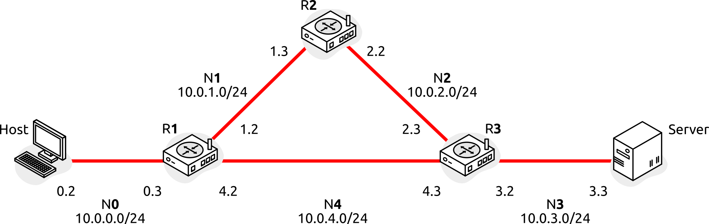

## Topology

## Static routing

Setup:

    $ make static

Show routing tables:

    $ docker exec r1 ip route
    default via 10.0.4.3 dev eth1
    10.0.0.0/24 dev eth2 proto kernel scope link src 10.0.0.3
    10.0.1.0/24 dev eth0 proto kernel scope link src 10.0.1.2
    10.0.4.0/24 dev eth1 proto kernel scope link src 10.0.4.2

Ping Server:

    $ ping -c1 10.0.3.3
    PING 10.0.3.3 (10.0.3.3) 56(84) bytes of data.
    64 bytes from 10.0.3.3: icmp_seq=1 ttl=62 time=0.164 ms

Traceroute Server:

    $ traceroute 10.0.3.3
    traceroute to 10.0.3.3 (10.0.3.3), 30 hops max, 60 byte packets
    1  10.0.0.3 (10.0.0.3)  0.361 ms  0.309 ms  0.293 ms
    2  10.0.4.3 (10.0.4.3)  0.280 ms  0.252 ms  0.235 ms
    3  10.0.3.3 (10.0.3.3)  0.219 ms  0.191 ms  0.171 ms

## RIPv2

Docs:

- https://docs.frrouting.org/en/stable-10.2/ripd.html

Setup:

    $ make rip

Check config:

    $ docker exec r1 ip route
    default via 10.0.4.3 dev eth2
    10.0.0.0/24 dev eth0 proto kernel scope link src 10.0.0.3
    10.0.1.0/24 dev eth1 proto kernel scope link src 10.0.1.2
    10.0.2.0/24 nhid 10 via 10.0.1.3 dev eth1 proto rip metric 20
    10.0.3.0/24 nhid 12 via 10.0.4.3 dev eth2 proto rip metric 20
    10.0.4.0/24 dev eth2 proto kernel scope link src 10.0.4.2

    $ docker exec r1 vtysh -c "show running-config"
    Building configuration...

    Current configuration:
    !
    frr version 8.4.4
    frr defaults traditional
    hostname r1
    no ipv6 forwarding
    service integrated-vtysh-config
    !
    router rip
    network 10.0.0.0/24
    network 10.0.1.0/24
    network 10.0.4.0/24
    exit
    !
    end

Show routing info:

    $ docker exec r1 vtysh -c "show ip route"
    Codes: K - kernel route, C - connected, S - static, R - RIP,
        O - OSPF, I - IS-IS, B - BGP, E - EIGRP, N - NHRP,
        T - Table, v - VNC, V - VNC-Direct, A - Babel, F - PBR,
        f - OpenFabric,
        > - selected route, * - FIB route, q - queued, r - rejected, b - backup
        t - trapped, o - offload failure

    K>* 0.0.0.0/0 [0/0] via 10.0.4.3, eth2, 00:00:30
    C>* 10.0.0.0/24 is directly connected, eth0, 00:00:30
    C>* 10.0.1.0/24 is directly connected, eth1, 00:00:30
    R>* 10.0.2.0/24 [120/2] via 10.0.1.3, eth1, weight 1, 00:00:24
    R>* 10.0.3.0/24 [120/2] via 10.0.4.3, eth2, weight 1, 00:00:24
    C>* 10.0.4.0/24 is directly connected, eth2, 00:00:30

Show RIP info:

    $ docker exec r1 vtysh -c "show ip rip"
    Codes: R - RIP, C - connected, S - Static, O - OSPF, B - BGP
    Sub-codes:
        (n) - normal, (s) - static, (d) - default, (r) - redistribute,
        (i) - interface

        Network            Next Hop         Metric From            Tag Time
    C(i) 10.0.0.0/24        0.0.0.0               1 self              0
    C(i) 10.0.1.0/24        0.0.0.0               1 self              0
    R(n) 10.0.2.0/24        10.0.1.3              2 10.0.1.3          0 02:48
    R(n) 10.0.3.0/24        10.0.4.3              2 10.0.4.3          0 02:57
    C(i) 10.0.4.0/24        0.0.0.0               1 self              0

Capture RIP traffic:

    $ docker exec -ti r1 tshark -i any -Y rip -V
    Routing Information Protocol
        Command: Request (1)
        Version: RIPv2 (2)
        Address not specified, Metric: 16
            Address Family: Unspecified (0)
            Route Tag: 0
            Netmask: 0.0.0.0
            Next Hop: 0.0.0.0
            Metric: 16

    Routing Information Protocol
        Command: Response (2)
        Version: RIPv2 (2)
        IP Address: 10.0.0.0, Metric: 1
            Address Family: IP (2)
            Route Tag: 0
            IP Address: 10.0.0.0
            Netmask: 255.255.255.0
            Next Hop: 0.0.0.0
            Metric: 1
        IP Address: 10.0.4.0, Metric: 1
            Address Family: IP (2)
            Route Tag: 0
            IP Address: 10.0.4.0
            Netmask: 255.255.255.0
            Next Hop: 0.0.0.0
            Metric: 1

## OSPFv2

Docs:

- https://docs.frrouting.org/en/stable-10.2/ospfd.html

Setup:

    $ make ospf

Show routing info:

    $ docker exec r1 vtysh -c "show ip route"
    Codes: K - kernel route, C - connected, S - static, R - RIP,
        O - OSPF, I - IS-IS, B - BGP, E - EIGRP, N - NHRP,
        T - Table, v - VNC, V - VNC-Direct, A - Babel, F - PBR,
        f - OpenFabric,
        > - selected route, * - FIB route, q - queued, r - rejected, b - backup
        t - trapped, o - offload failure

    O   10.0.0.0/24 [110/10] is directly connected, eth2, weight 1, 00:01:14
    C>* 10.0.0.0/24 is directly connected, eth2, 00:01:15
    O   10.0.1.0/24 [110/10] is directly connected, eth0, weight 1, 00:01:14
    C>* 10.0.1.0/24 is directly connected, eth0, 00:01:15
    O>* 10.0.2.0/24 [110/20] via 10.0.1.3, eth0, weight 1, 00:00:24
    *                      via 10.0.4.3, eth1, weight 1, 00:00:24
    O>* 10.0.3.0/24 [110/20] via 10.0.4.3, eth1, weight 1, 00:00:24
    O   10.0.4.0/24 [110/10] is directly connected, eth1, weight 1, 00:00:34
    C>* 10.0.4.0/24 is directly connected, eth1, 00:01:15

Show OSPF info:

    $ docker exec r1 vtysh -c "show ip ospf route"
    ============ OSPF network routing table ============
    N    10.0.0.0/24           [10] area: 0.0.0.0
                            directly attached to eth1
    N    10.0.1.0/24           [10] area: 0.0.0.0
                            directly attached to eth2
    N    10.0.2.0/24           [20] area: 0.0.0.0
                            via 10.0.1.3, eth2
                            via 10.0.4.3, eth0
    N    10.0.3.0/24           [20] area: 0.0.0.0
                            via 10.0.4.3, eth0
    N    10.0.4.0/24           [10] area: 0.0.0.0
                            directly attached to eth0

    ============ OSPF router routing table =============
    R    10.0.2.2              [10] area: 0.0.0.0, ASBR
                            via 10.0.1.3, eth2
    R    10.0.4.3              [10] area: 0.0.0.0, ASBR
                            via 10.0.4.3, eth0

    ============ OSPF external routing table ===========

Show OSPF database:

    $ docker exec r1 vtysh -c "show ip ospf database "

        OSPF Router with ID (10.0.4.2)

                    Router Link States (Area 0.0.0.0)

    Link ID         ADV Router      Age  Seq#       CkSum  Link count
    10.0.2.2       10.0.2.2         176 0x80000007 0x4c88 2
    10.0.4.2       10.0.4.2         175 0x80000009 0x4364 3
    10.0.4.3       10.0.4.3         179 0x80000008 0x712d 3

                    Net Link States (Area 0.0.0.0)

    Link ID         ADV Router      Age  Seq#       CkSum
    10.0.1.2       10.0.4.2         175 0x80000001 0x809e
    10.0.2.3       10.0.4.3         180 0x80000001 0x7b9f
    10.0.4.3       10.0.4.3         180 0x80000001 0x779f

Neighbors:

    $ docker exec r1 vtysh -c "show ip ospf neighbor"

    Neighbor ID   Pri State           Up Time   Dead Time Address    Interface       RXmtL RqstL DBsmL
    10.0.4.3        1 2-Way/DROther   12.526s     37.473s 10.0.4.3   eth0:10.0.4.2       0     0     0
    10.0.2.2        1 2-Way/DROther   12.654s     37.345s 10.0.1.3   eth2:10.0.1.2       0     0     0

Capture RIP traffic:

    $ docker exec -ti r1 tshark -i any -Y ospf -V
    Open Shortest Path First
        OSPF Header
            Version: 2
            Message Type: Hello Packet (1)
            Packet Length: 44
            Source OSPF Router: 10.0.4.2
            Area ID: 0.0.0.0 (Backbone)
            Checksum: 0xee9c [correct]
            Auth Type: Null (0)
            Auth Data (none): 0000000000000000
        OSPF Hello Packet
            Network Mask: 255.255.255.0
            Hello Interval [sec]: 10
            Options: 0x02, (E) External Routing
                0... .... = DN: Not set
                .0.. .... = O: Not set
                ..0. .... = (DC) Demand Circuits: Not supported
                ...0 .... = (L) LLS Data block: Not Present
                .... 0... = (N) NSSA: Not supported
                .... .0.. = (MC) Multicast: Not capable
                .... ..1. = (E) External Routing: Capable
                .... ...0 = (MT) Multi-Topology Routing: No
            Router Priority: 1
            Router Dead Interval [sec]: 40
            Designated Router: 0.0.0.0
            Backup Designated Router: 0.0.0.0

    Open Shortest Path First
        OSPF Header
            Version: 2
            Message Type: DB Description (2)
            Packet Length: 32
            Source OSPF Router: 10.0.4.2
            Area ID: 0.0.0.0 (Backbone)
            Checksum: 0x962d [correct]
            Auth Type: Null (0)
            Auth Data (none): 0000000000000000
        OSPF DB Description
            Interface MTU: 1500
            Options: 0x02, (E) External Routing
                0... .... = DN: Not set
                .0.. .... = O: Not set
                ..0. .... = (DC) Demand Circuits: Not supported
                ...0 .... = (L) LLS Data block: Not Present
                .... 0... = (N) NSSA: Not supported
                .... .0.. = (MC) Multicast: Not capable
                .... ..1. = (E) External Routing: Capable
                .... ...0 = (MT) Multi-Topology Routing: No
            DB Description: 0x07, (I) Init, (M) More, (MS) Master
                .... 0... = (R) OOBResync: Not set
                .... .1.. = (I) Init: Set
                .... ..1. = (M) More: Set
                .... ...1 = (MS) Master: Yes
            DD Sequence: 779756369

    Open Shortest Path First
        OSPF Header
            Version: 2
            Message Type: LS Request (3)
            Packet Length: 36
            Source OSPF Router: 10.0.4.3
            Area ID: 0.0.0.0 (Backbone)
            Checksum: 0xd3d0 [correct]
            Auth Type: Null (0)
            Auth Data (none): 0000000000000000
        Link State Request
            LS Type: Router-LSA (1)
            Link State ID: 10.0.4.2
            Advertising Router: 10.0.4.2

    Open Shortest Path First
        OSPF Header
            Version: 2
            Message Type: LS Update (4)
            Packet Length: 88
            Source OSPF Router: 10.0.4.2
            Area ID: 0.0.0.0 (Backbone)
            Checksum: 0x810e [correct]
            Auth Type: Null (0)
            Auth Data (none): 0000000000000000
        LS Update Packet
            Number of LSAs: 1
            LSA-type 1 (Router-LSA), len 60
                .000 0000 0000 0001 = LS Age (seconds): 1
                0... .... .... .... = Do Not Age Flag: 0
                Options: 0x02, (E) External Routing
                    0... .... = DN: Not set
                    .0.. .... = O: Not set
                    ..0. .... = (DC) Demand Circuits: Not supported
                    ...0 .... = (L) LLS Data block: Not Present
                    .... 0... = (N) NSSA: Not supported
                    .... .0.. = (MC) Multicast: Not capable
                    .... ..1. = (E) External Routing: Capable
                    .... ...0 = (MT) Multi-Topology Routing: No
                LS Type: Router-LSA (1)
                Link State ID: 10.0.4.2
                Advertising Router: 10.0.4.2
                Sequence Number: 0x80000006
                Checksum: 0xa525
                Length: 60
                Flags: 0x02, (E) AS boundary router
                    0... .... = (H) flag: No
                    ...0 .... = (N) flag: No
                    .... 0... = (W) Wild-card multicast receiver: No
                    .... .0.. = (V) Virtual link endpoint: No
                    .... ..1. = (E) AS boundary router: Yes
                    .... ...0 = (B) Area border router: No
                Number of Links: 3
                Type: Stub     ID: 10.0.1.0        Data: 255.255.255.0   Metric: 10
                    Link ID: 10.0.1.0 - IP network/subnet number
                    Link Data: 255.255.255.0
                    Link Type: 3 - Connection to a stub network
                    Number of Metrics: 0 - TOS
                    0 Metric: 10
                Type: Stub     ID: 10.0.4.0        Data: 255.255.255.0   Metric: 10
                    Link ID: 10.0.4.0 - IP network/subnet number
                    Link Data: 255.255.255.0
                    Link Type: 3 - Connection to a stub network
                    Number of Metrics: 0 - TOS
                    0 Metric: 10
                Type: Stub     ID: 10.0.0.0        Data: 255.255.255.0   Metric: 10
                    Link ID: 10.0.0.0 - IP network/subnet number
                    Link Data: 255.255.255.0
                    Link Type: 3 - Connection to a stub network
                    Number of Metrics: 0 - TOS
                    0 Metric: 10

    Open Shortest Path First
        OSPF Header
            Version: 2
            Message Type: LS Acknowledge (5)
            Packet Length: 44
            Source OSPF Router: 10.0.4.3
            Area ID: 0.0.0.0 (Backbone)
            Checksum: 0xac5d [correct]
            Auth Type: Null (0)
            Auth Data (none): 0000000000000000
        LSA-type 1 (Router-LSA), len 60
            .000 0000 0000 0001 = LS Age (seconds): 1
            0... .... .... .... = Do Not Age Flag: 0
            Options: 0x02, (E) External Routing
                0... .... = DN: Not set
                .0.. .... = O: Not set
                ..0. .... = (DC) Demand Circuits: Not supported
                ...0 .... = (L) LLS Data block: Not Present
                .... 0... = (N) NSSA: Not supported
                .... .0.. = (MC) Multicast: Not capable
                .... ..1. = (E) External Routing: Capable
                .... ...0 = (MT) Multi-Topology Routing: No
            LS Type: Router-LSA (1)
            Link State ID: 10.0.4.2
            Advertising Router: 10.0.4.2
            Sequence Number: 0x80000006
            Checksum: 0xa525
            Length: 60

## EIGRP

Setup:

    $ make eigrp

Check routes:

    $ docker exec r1 ip route
    10.0.0.0/24 dev eth0 proto kernel scope link src 10.0.0.3
    10.0.1.0/24 dev eth2 proto kernel scope link src 10.0.1.2
    10.0.2.0/24 nhid 24 proto eigrp metric 20
        nexthop via 10.0.1.3 dev eth2 weight 1
        nexthop via 10.0.4.3 dev eth1 weight 1
    10.0.3.0/24 nhid 25 via 10.0.4.3 dev eth1 proto eigrp metric 20
    10.0.4.0/24 dev eth1 proto kernel scope link src 10.0.4.2

Show routing info:

    $ docker exec r1 vtysh -c "show ip route"
    Codes: K - kernel route, C - connected, S - static, R - RIP,
        O - OSPF, I - IS-IS, B - BGP, E - EIGRP, N - NHRP,
        T - Table, v - VNC, V - VNC-Direct, A - Babel, F - PBR,
        f - OpenFabric,
        > - selected route, * - FIB route, q - queued, r - rejected, b - backup
        t - trapped, o - offload failure

    E   10.0.0.0/24 [90/28160] is directly connected, eth0, weight 1, 00:01:32
    C>* 10.0.0.0/24 is directly connected, eth0, 00:01:35
    E   10.0.1.0/24 [90/28160] is directly connected, eth2, weight 1, 00:01:32
    C>* 10.0.1.0/24 is directly connected, eth2, 00:01:35
    E>* 10.0.2.0/24 [90/30720] via 10.0.1.3, eth2, weight 1, 00:01:32
    *                          via 10.0.4.3, eth1, weight 1, 00:01:32
    E>* 10.0.3.0/24 [90/30720] via 10.0.4.3, eth1, weight 1, 00:01:32
    E   10.0.4.0/24 [90/28160] is directly connected, eth1, weight 1, 00:01:33
    C>* 10.0.4.0/24 is directly connected, eth1, 00:01:35

Show EIGRP info:

    $ docker exec r1 vtysh -c "show ip eigrp topology"
    EIGRP Topology Table for AS(100)/ID(10.0.4.2)

    Codes: P - Passive, A - Active, U - Update, Q - Query, R - Reply
        r - reply Status, s - sia Status

    P  10.0.0.0/24, 1 successors, FD is 28160, serno: 0
        via Connected, eth0
    P  10.0.1.0/24, 1 successors, FD is 28160, serno: 0
        via Connected, eth2
    P  10.0.2.0/24, 2 successors, FD is 30720, serno: 0
        via 10.0.1.3 (30720/28160), eth2
        via 10.0.4.3 (30720/28160), eth1
    P  10.0.3.0/24, 1 successors, FD is 30720, serno: 0
        via 10.0.4.3 (30720/28160), eth1
    P  10.0.4.0/24, 1 successors, FD is 28160, serno: 0
        via Connected, eth1

Neighbors:

    $ docker exec r1 vtysh -c "show ip eigrp neighbor"

    EIGRP neighbors for AS(100)

    H   Address           Interface            Hold   Uptime   SRTT   RTO   Q     Seq
                                            (sec)           (ms)        Cnt    Num
    0   10.0.4.3          eth1                 11     0        0      2    0      3
    0   10.0.1.3          eth2                 11     0        0      2    0      3
